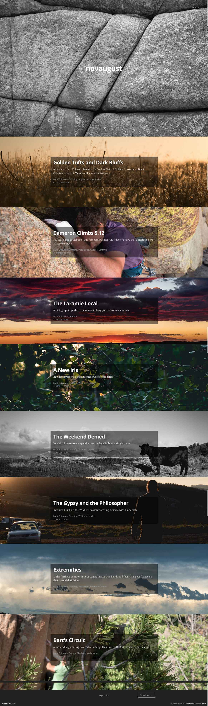
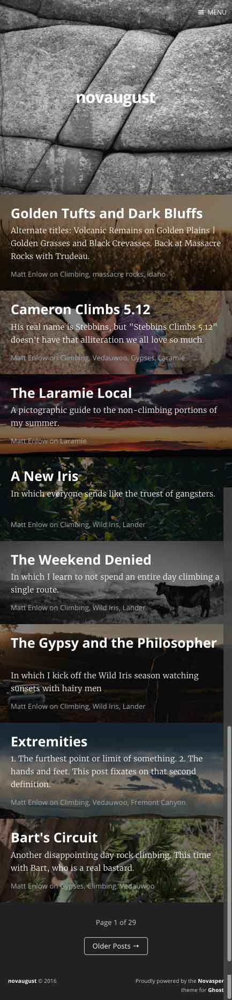

# Novasper

This is a customization of the default theme for [Ghost](http://github.com/tryghost/ghost/), [Casper](http://github.com/tryghost/casper/)).

**To download** visit the [releases](https://github.com/novaugust/novasper/releases) page.

## Features

- **Post Description**: post `meta_description` is used as the post excerpt description text, rather than the first x words of the post
- **Post Image**: On any page with post excerpts (home page, archive page, author page, tag page, etc), the post's image is displayed as a full-width background image behind the post excerpt.
- **Full width images**: images within posts are displayed at full browser width
- **Post excerpt hover effect**: There's a cute animation when you hover over post titles, stolen from Tympanus. That's all.

## Examples

### Live

You can see this theme in action at

- [blog.novaugust.net](http://blog.novaugust.net)
- [smaertin](http://smaertin.com)

### Screenshots

Taken from [blog.novaugust.net](blog.novaugust.net) with post count set to eight.

#### Full-sized

#### Mobile

## Copyright & License

#### Novasper

Copyright 2014-2016 Matt Enlow. Released under MIT License.

#### Casper

Copyright (c) 2013-2016 Ghost Foundation - Released under the MIT License.

### MIT

Permission is hereby granted, free of charge, to any person obtaining a copy of this software and associated documentation files (the "Software"), to deal in the Software without restriction, including without limitation the rights to use, copy, modify, merge, publish, distribute, sublicense, and/or sell copies of the Software, and to permit persons to whom the Software is furnished to do so, subject to the following conditions:

The above copyright notice and this permission notice shall be included in all copies or substantial portions of the Software.

THE SOFTWARE IS PROVIDED "AS IS", WITHOUT WARRANTY OF ANY KIND, EXPRESS OR IMPLIED, INCLUDING BUT NOT LIMITED TO THE WARRANTIES OF MERCHANTABILITY, FITNESS FOR A PARTICULAR PURPOSE AND
NONINFRINGEMENT. IN NO EVENT SHALL THE AUTHORS OR COPYRIGHT HOLDERS BE LIABLE FOR ANY CLAIM, DAMAGES OR OTHER LIABILITY, WHETHER IN AN ACTION OF CONTRACT, TORT OR OTHERWISE, ARISING FROM, OUT OF OR IN CONNECTION WITH THE SOFTWARE OR THE USE OR OTHER DEALINGS IN THE SOFTWARE.
